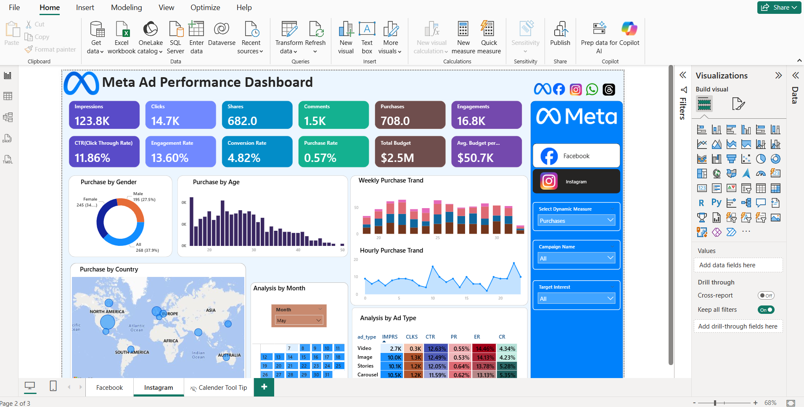

# 📊 Meta Ad Performance Dashboard (Power BI)

## 🔍 Project Overview
This project showcases an interactive **Power BI dashboard** analyzing Meta Ads performance across **Facebook and Instagram** platforms.

The dashboard provides actionable insights into campaign performance, user engagement, demographics, and purchase behavior.

---

## 📌 Key Metrics

- Impressions  
- Clicks  
- CTR (Click Through Rate)  
- Engagement Rate  
- Conversion Rate  
- Purchases  
- Budget Analysis  

---

## 🛠 Tools & Technologies

- Power BI  
- SQL  
- Excel  
- DAX  

---

## 📈 Facebook Dashboard

---

## 📊 Instagram Dashboard

---

## 🔎 Features

✔ Demographic Analysis (Age, Gender, Country)  
✔ Hourly & Weekly Trends  
✔ Campaign Performance  
✔ Ad Type Comparison  
✔ Dynamic Filters  
✔ KPI Cards  

---

## 💡 Insights Generated

- Highest engagement observed in 18–35 age group  
- Stories ads showed better conversion  
- Instagram performed higher in purchase rate  
- Peak activity during evening hours  
 _ _ _

## 📁 Files Included

- Power BI (.pbix) file  
- Dashboard screenshots  
- Dataset  

---

## 👩‍💻 Author

**Khushi Sharma**  
Aspiring Data Analyst  

🔗 GitHub: https://github.com/Khushi-8076  

---

⭐ If you like this project, feel free to star this repository!
